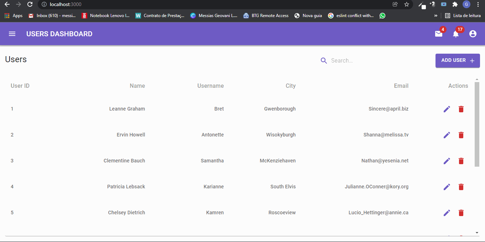

<div align="center" id="top"> 
  

  &#xa0;

  <!-- <a href="https://codigodoallan.netlify.app">Demo</a> -->
</div>

<h1 align="center">Users Dashboard</h1>

<p align="center">
  

  

  

  

  <!--  -->

  <!--  -->

  <!--  -->
</p>

<!-- Status -->

<!-- <h4 align="center"> 
	🚧  Users Dashboard 🚀 Under construction...  🚧
</h4> 

<hr> -->

<p align="center">
  <a href="#dart-about">About</a> &#xa0; | &#xa0; 
  <a href="#sparkles-features">Features</a> &#xa0; | &#xa0;
  <a href="#rocket-technologies">Technologies</a> &#xa0; | &#xa0;
  <a href="#white_check_mark-requirements">Requirements</a> &#xa0; | &#xa0;
  <a href="#checkered_flag-starting">Starting</a> &#xa0; | &#xa0;
  <a href="#memo-license">License</a> &#xa0; | &#xa0;
  <a href="https://github.com/messiasGeovani" target="_blank">Author</a>
</p>

<br>

## :dart: About ##

Describe your project

## :sparkles: Features ##

:heavy_check_mark: Users management;\

## :rocket: Technologies ##

The following tools were used in this project:

- [React](https://pt-br.reactjs.org/)
- [Material UI](https://mui.com/pt/)
- [Redux](https://redux.js.org/)
- [Redux Saga](https://redux-saga.js.org/)

## :white_check_mark: Requirements ##

Before starting :checkered_flag:, you need to have [Git](https://git-scm.com) and [Node](https://nodejs.org/en/) installed.

## :checkered_flag: Starting ##

```bash
# Clone this project
$ git clone https://github.com/messiasGeovani/users-dashboard

# Access
$ cd users-dashboard

# Install dependencies
$ yarn

# Run the project
$ yarn start

# The server will initialize in the <http://localhost:3000>
```

Made with :heart: by <a href="https://github.com/messiasGeovani" target="_blank">Messias Geovani</a>

&#xa0;

<a href="#top">Back to top</a>
